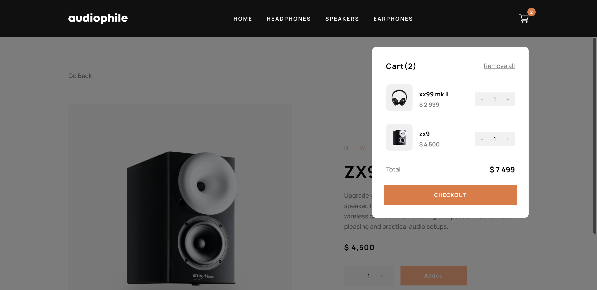
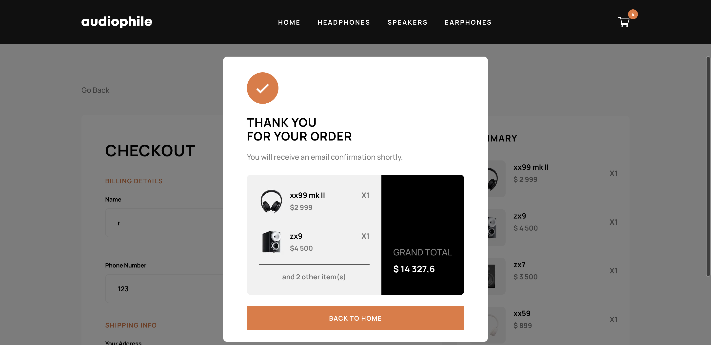

# Frontend Mentor - Audiophile e-commerce website solution

[](https://opensource.org/licenses/Apache-2.0)

## Table of contents

- [Overview](#overview)
  - [The challenge](#the-challenge)
  - [Screenshot](#screenshot)
  - [Links](#links)
- [My process](#my-process)
  - [Built with](#built-with)
- [Author](#author)

## Overview

Users are able to:

- View the optimal layout for the app depending on their device's screen size
- See hover states for all interactive elements on the page
- Add/Remove products from the cart
- Edit product quantities in the cart
- Fill in all fields in the checkout
- Receive form validations if fields are missed or incorrect during checkout
- See correct checkout totals depending on the products in the cart
  - Shipping always adds $50 to the order
  - VAT is calculated as 20% of the product total, excluding shipping
- See an order confirmation modal after checking out with an order summary
- Keep track of what's in the cart, even after refreshing the browser
- Stripe is integrated into the checkout page where users get to choose payment methods based on their location

**Stripe payment is a test hence the following card number can be entered at checkout**

```bash
4242424242424242
```

```bash
4000002500003155
```

### Screenshot





### Links

- Solution URL: [https://github.com/12Ricky0/ecomm-app.git](https://github.com/12Ricky0/ecomm-app.git)
- Live Site URL: [https://audiophile-12ricky0.vercel.app/](https://audiophile-12ricky0.vercel.app/)

## My process

### Built with

- Tailwind CSS
- Mobile-first workflow
- MongoDB
- TypeScript
- [React](https://reactjs.org/) - JS library
- [Next.js](https://nextjs.org/) - React framework
- [Stripe](https://stripe.com/)

## Author

- Frontend Mentor - [@12Ricky0](https://www.frontendmentor.io/profile/12Ricky0)
- Instagram - [@temple4b](https://www.instagram.com/temple4b)
